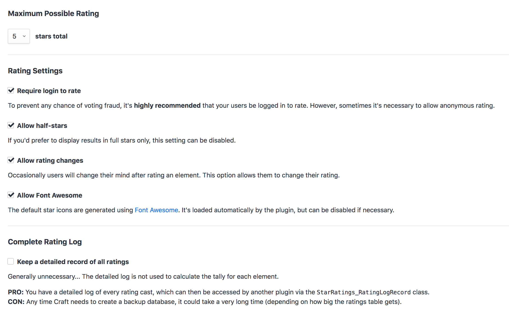

Star Ratings plugin for Craft CMS
=================================

An easy to use and highly flexible ratings system.


***

## Rate Elements

Just specify the element ID of the item you want to rate. Any element type (Entry, Asset, User, etc) will work!

```twig
{{ craft.starRatings.stars(entry.id) }}
```

## Customize Star Icons

It's easy to customize your star icons. You can either [adjust the CSS](https://www.doublesecretagency.com/plugins/star-ratings/docs/customize-your-star-css), or [replace the icons entirely](https://www.doublesecretagency.com/plugins/star-ratings/docs/customize-your-star-icons).

```twig

```

By default, Star Ratings uses the Font Awesome library. Which means you can easily swap to a different icon from the Font Awesome collection. And if you'd rather not use Font Awesome, you can disable the library from being included at all.

## Sort by Highest Rated

Once your users have cast ratings, you'll want to know which items are the [highest rated...](https://www.doublesecretagency.com/plugins/star-ratings/docs/sort-by-highest-rated)

```twig

```

## Settings

Here's a screenshot of the plugin's settings page...



To see some other ways that Star Ratings is flexible, check out the [full documentation...](https://www.doublesecretagency.com/plugins/star-ratings/docs)

***

## Anything else?

We've got other plugins too!

Check out the full catalog at [doublesecretagency.com/plugins](https://www.doublesecretagency.com/plugins)
